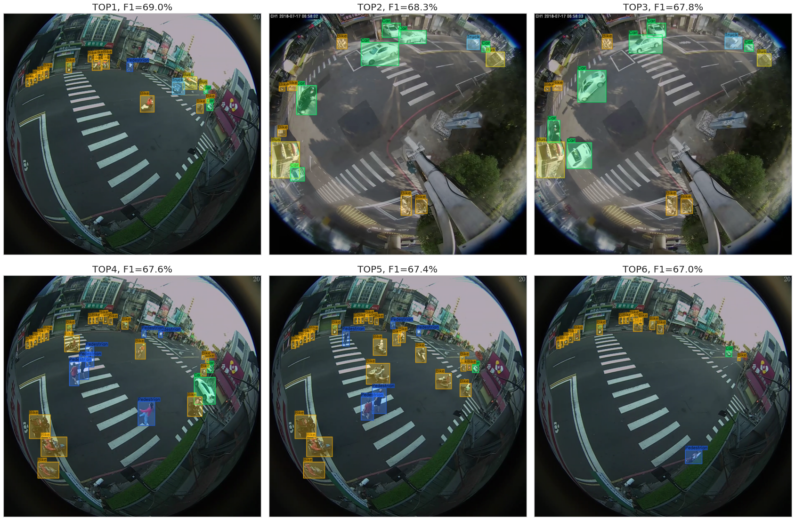
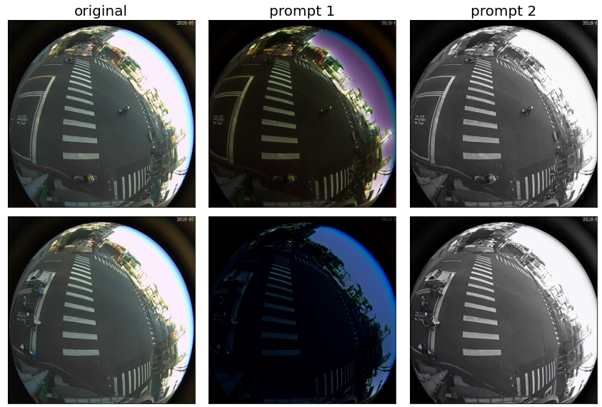
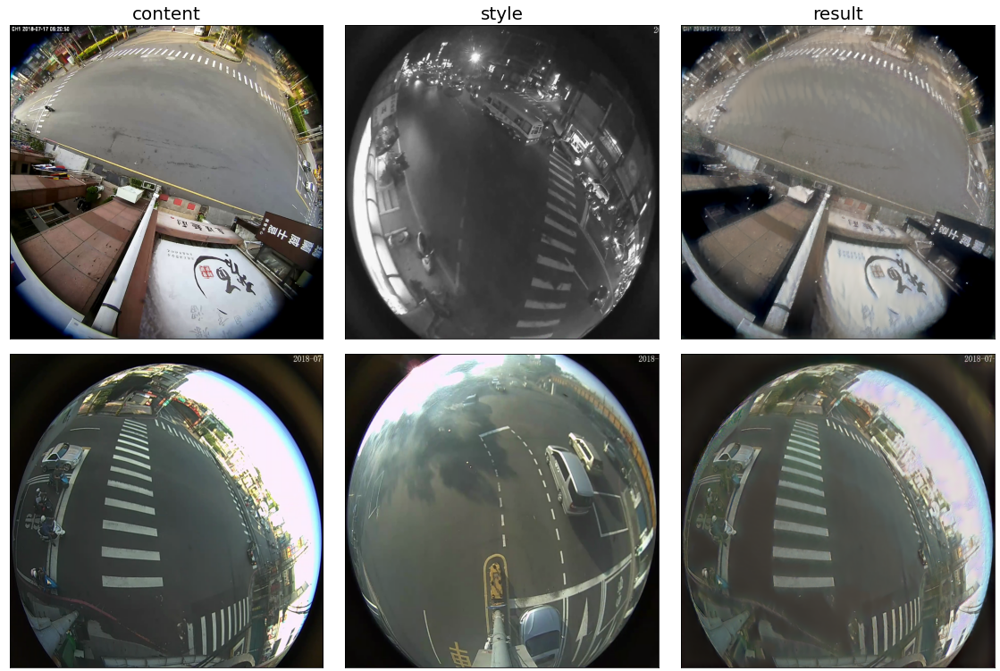

# AiCity24 DeepDrivePL

This repository presents training and testing code prepared by us as part of the [AiCityChallenge2024](https://www.aicitychallenge.org) (Track 4: Road Object Detection in Fish-Eye Cameras).
We focused on utilizing additional traffic-oriented datasets and transforming them to make the images similar to FishEye8K. You can:
- Download the original dataset, COCO-style annotations, and our pre-trained model to run inference and compute metrics.
- Download the entire augmented training set and run training according to our strategy.
- Download only the original data and generate the transformed images yourself.

<p align="center">
  
</p>

Originally, the FishEye8K dataset is divided into train (5288 images) and validation (2712 images) splits. We kept all 2712 validation images as a local test set, and for validation, we extracted 2 whole sequences (621 images). So in our code, and data, the following terms are used: 
- `train` - 4667 images
- `validation` - 621 images (originally part of the train set)
- `test` - 2712 images
- `test-challenge` - 1000 images (without annotations)


## Dependencies

We provide a Dockerfile that handles all the dependencies needed in this repository.
```console
cd scripts/mmdet
./build_and_run.sh
```


## Run inference using a trained Co-DETR model

To reproduce the values presented in the leaderboard, you need to download the FishEye8K dataset along with the annotations in COCO format, as well as our best Co-DETR model.


### Download data

1. Download and extract the trained Co-DETR model
2. Download and extract the original (non-augmented) FishEye8K dataset


### Run inference

Run inference on validation and test-challenge data (inside a container). 
```console
cd /aicity/scripts/mmdet/
./test.sh
```


### Filter detections & evaluate

For evaluation we use a [modified pycocotools library](https://github.com/deepdrivepl/FE8K-eval).\
Our reposotory is a pip-installable version of https://github.com/MoyoG/FishEye8K/tree/main/evaluation_Linux.

```console
cd /aicity/scripts
python run_filtering_and_eval.py --detections mmdet/006-ep7-val.bbox.json
python run_filtering_and_eval.py --detections mmdet/006-ep7-test-challenge.bbox.json --split test-challenge
```
The provided script will filter detections according to class-dependent confidence thresholds. These thresholds were chosen experimentally to maximize the F1 score on the test set (original validation) and are as follows: 
```python
{'Bike': 0.4, 'Bus': 0.5, 'Car': 0.5, 'Pedestrian': 0.4, 'Truck': 0.45}
```
If `--split` is different from "test-challenge", and `--skip_metrics` is not specified, the script will also calculate metrics for the specified detection file `--detections`.


## Run training

In order to train the Co-DETR model, you can either download the already augmented dataset, or generate it yourself.


### Download augmented dataset

Dataset can be downloaded from https://archive.org/details/006-epoch-7

### Generate augmented dataset

1. Download non-augmented datasets
2. Run distortion (VisDrone, UAVDT)
   ```console
   cd /aicity/scripts
   python gen_distorted.py --debug
   ```
4. Run pixel-level data augmentation (WoodScape, VisDrone, UAVDT)
   ```console
   cd /aicity/scripts
   python gen_augmented.py --debug
   ```
5. Run GAN-based data augmentation

   [**InstructPix2Pix: Learning to Follow Image Editing Instructions**](https://github.com/timothybrooks/instruct-pix2pix)
   ```console
   cd /aicity/3rdparty/instruct-pix2pix
   ./scripts/download_checkpoints.sh
   python generate-FE8K.py
   ```
   

   
   [**Image Style Transfer Using Convolutional Neural Networks**](https://github.com/gordicaleksa/pytorch-neural-style-transfer)
   ```console
   cd /aicity/3rdparty/pytorch-neural-style-transfer
   python style_transfer_FE8K.py
   ```
   
   
   
3. Generate COCO-style annotations

   The script will copy all the augmented images to the specified `--out_dir`, along with the annotations in COCO format. 
   ```console
   python convert2coco.py --out_dir ../data/augmented-all
   ```

   
### Run training

Our training strategy is as follows:
1. Train Co-DINO Swin-L for 16 epochs with the augmented dataset.
2. Fine-tune the model with the best F1 score for 5 epochs using the train-test dataset.
3. Fine-tune once more for 16 epochs using the train-test dataset.

Run `/aicity/scripts/mmdet/train-mmdet-codetr.sh` to reproduce the above training strategy, but keep in mind that you may need to adjust the `load_from path` in each of the config files (as well as dataset paths if you generated the dataset yourself). We selected the best checkpoints for fine-tuning based on F1 score.

## Submitted model

Our final submitted model can be downloaded from https://archive.org/details/006-epoch-7
